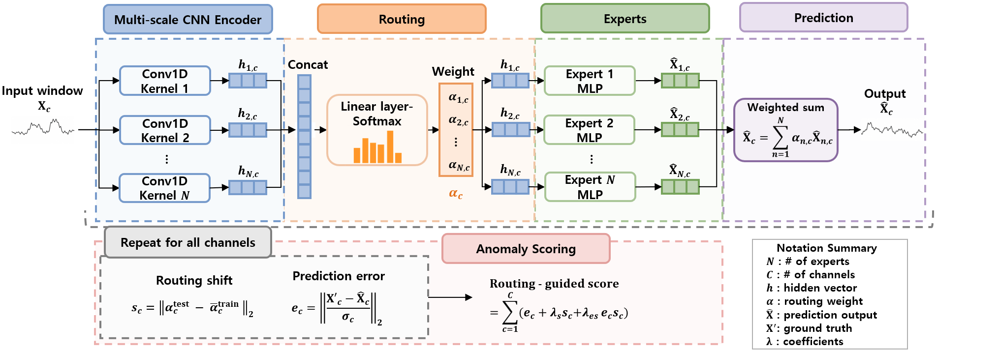
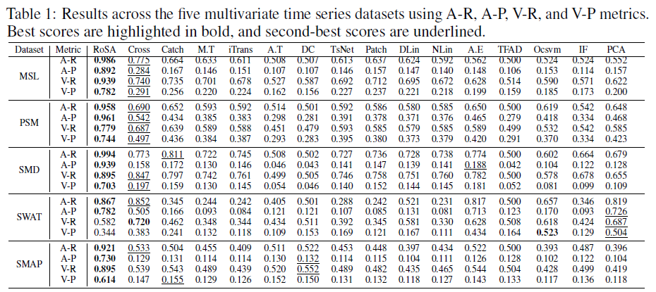

# RoSA: Expert Routing Shifts for Multivariate Time Series Anomaly Detection

## Abstract

Multivariate time series anomaly detection is commonly approached using forecasting or reconstruction models, where anomalies are identified based on prediction errors. However, modern models can accurately predict not only normal patterns but also anomalous ones, making prediction error an unreliable signal for anomaly detection. To address this limitation, we propose RoSA, a routing shift-based anomaly detection framework that leverages the internal behavior of mixture-of
experts models. Our key insight is that even when prediction errors are small, anomalies cause shifts in how the model routes inputs to experts. RoSA captures these routing shifts and detects anomalies by identifying deviations from normal expert routing patterns. To ensure reliable routing pattern, we incorporate a Bures-Wasserstein alignment objective that preserves the statistical structure of normal data, which stabilizes expert specialization and improves the consistency of routing pattern. Extensive experiments on real-world datasets show that RoSA consistently outperforms strong baselines, particularly in challenging scenarios involving subtle anomalies, non-stationarity, and complex inter-channel dependencies. Our results demonstrate that modeling routing shift as an anomaly signal provides a robust alternative to prediction error-based approaches, offering a new perspective on anomaly detection by focusing on internal model behavior.

## Model Architecture



## Get Started

1. Create a virtual environment:

```bash
python -m venv rosa
source rosa/bin/activate
```

2. Install the required packages:

```bash
pip install -r requirements.txt
```

3. Run (Example: MSL dataset):

```bash
python run.py
```

## Datasets

**Mars Science Laboratory (MSL)** ([source](https://www.kaggle.com/datasets/patrickfleith/nasa-anomaly-detection-dataset-smap-msl))

**Soil Moisture Active Passive (SMAP)** ([source](https://www.kaggle.com/datasets/patrickfleith/nasa-anomaly-detection-dataset-smap-msl))

**Server Machine Dataset (SMD)** ([source](https://github.com/NetManAIOps/OmniAnomaly/tree/master/ServerMachineDataset))

**Secure Water Treatment (SWaT)** ([source](https://itrust.sutd.edu.sg/testbeds/secure-water-treatment-swat/))

**Pooled Server Metrics (PSM)** ([source](https://github.com/eBay/RANSynCoders))

## Main Result

